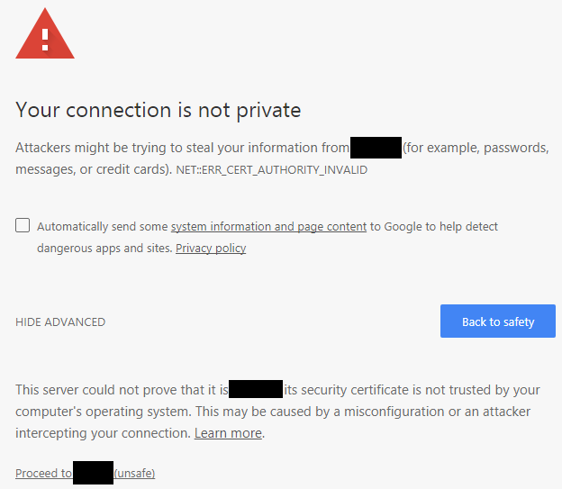
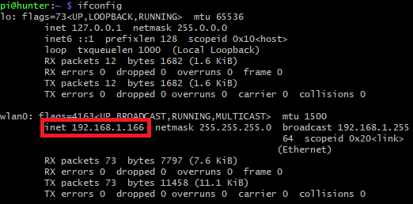

# The Hunt Client - Tutorial

## Introduction
In terms of software, participants are given a [Raspberry Pi Zero W](https://www.raspberrypi.com/products/raspberry-pi-zero-w/) microcomputer that will be attched to the chassis of their robot in order to host the Web App and provide control over electronic components such as motors and servos. Participants are also given a [Raspberry Pi Camera](https://www.raspberrypi.com/documentation/accessories/camera.html) as during the competition participants will be remotely controlling their robot through a video stream in order to find targets during the scavenger hunt.

**Although this may sound very daunting, much of the [code is already provided](client) by the eboard.** 

## What is `config.json`?
By default, teams will have to change the password in the [`config.json`](config.json) file and notify the eboard. This way the eboard can ensure that no team besides your own is able to access your code. The only other parameter in this file is the `developer-mode` setting which is to be `true` any time before the competition otherwise, `false`. This setting determines whether connection to the competition server should be established, **if it is unable to connect the software will crash**.

## How to Connect to the Pi
Each raspberry pi should be already set up to connect to the SBRT network with SSH enabled. In order to login to the Pi, you must **first connect to the SBRT network** then type in [Git Bash](https://git-scm.com/downloads) (or any equivalent terminal):
```bash
ssh pi@<your-team-name>.local
```
This will ask you to sign in with your Pi's password. Contact an eboard member if you have not provided us with one yet.

Next, type `ls` and you will notice that the file structure is identical to the [client directory](client) in this repository. 

## How to Put Your Code on the Pi
You will put your frontend code in the [`controller`](controller/) directory and write your motor controls in the [`controls.py`](controls.py) Python script. Running the program `the-hunt-client` will connect the frontend to the Python script while also stream your robot's video. **It will crash if the camera is not connected/detected.**

If you wish to work on the code on your computer instead of on the Pi, you can simply copy your files over to the appropriate directory using the following commands:

This command will copy everything in the current folder on your computer to the `controller` directory on the Pi:
```bash
scp * pi@<your-team-name>.local:~/controller
```
It will ask for your password and then upon success, copy over your files.

This command assumes that `controls.py` is in the current folder on your computer and replaces it on the Pi:
```bash
scp controls.py pi@<your-team-name>.local:~/controls.py
```
It will ask for your password and then upon success, copy over your files once again.

## How to Run Your Code
In order to test your code in its entirety for the competition, run the following command:
```bash
sudo ./the-hunt-client
```
It should ask you to verify your settings. If your settings are not correct, press `Ctrl+C` to kill the program and change your settings. 

If your settings are correct, open in Google Chrome (or any other Chrome-based browser: Brave, Edge, etc.) and for the URL type:
```
https://<your-team-name>.local
```
You should be greeted with a page that looks like this: 

If you are not greeted by this page, SSH into your Pi and type `ifconfig`. You should see a screen like this: 

Use the `inet` value instead of `<your-team-name>.local`.
```
https://192.168.1.x/
```


Simply click **Advanced** and then **Proceed to site (unsafe)**. *The reason for this is because your browser doesn't have the same SSL certificate on the robot. It is **NOT** dangerous.*

Now, you should be prompted asking to enter your password. This is the password stated in [`config.json`](config.json). Upon success, you should see your robot's camera feed rotated 90 degrees. Otherwise, you will be disconnected and will need to refresh the page.

Most things can be fixed with a refresh, otherwise check if your Pi if it printed an error message.